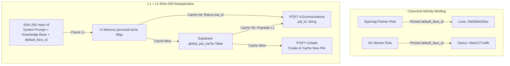
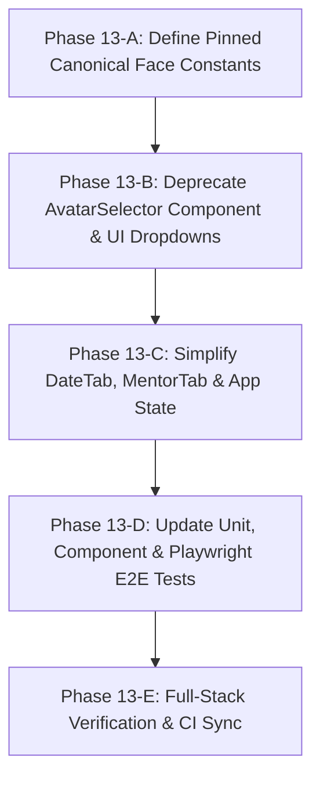

# Custom PAL Visual Persistence & Selector Deprecation Plan

This document details the engineering migration plan to establish **Canonical Visual Persistence** across AI Shadowboxing sessions and deprecate the manual avatar dropdown selector from the user interface.

---

### B. Custom Face Creation (`POST /v2/faces`) vs. Stock Replica Trade-offs

1. **How Custom Face Creation Works in Tavus:**
   * Custom face generation (`POST /v2/faces`) **cannot be created via text prompt on the fly**.
   * It requires uploading an existing high-resolution video URL (`train_video_url` - 1 min of speaking/listening footage) or a single front-facing photograph (`train_image_url`).
   * Face training is asynchronous and takes **20–60 minutes** on Tavus neural training clusters (`status: "training"` → `status: "ready"`).

2. **Impact on Real-Time Fluidity & Naturalness:**
   * **Image-Based Training (`train_image_url`):** Yields lower photorealism, static head movement, and unnatural lip-sync artifacts because the **Phoenix-4** Gaussian diffusion engine lacks multi-angle lighting and natural motion data.
   * **Stock Studio Replicas (Luna, Olivia, Darius, Steph):** Are trained on professional 4K studio video recordings under controlled multi-angle lighting with high-grade studio audio. They deliver maximum sub-500ms WebRTC streaming fluidity, natural micro-expressions, and flawless lip-sync.

3. **Strategic Identity Selection:**
   * **Sparring Partner (P0/P1):** Pinned to high-fidelity stock replica **Luna (`r9d30b0e55ac`)** (or **Olivia `rc2146c13e81`**).
   * **M1 Executive Mentor:** Pinned to high-authority stock replica **Darius (`r4ba1277e4fb`)** (or **Steph Office `r9c55f9312fb`**).
   * *Conclusion:* We stick with high-fidelity studio stock replicas pinned to canonical constants (`CANONICAL_PARTNER_FACE_ID` & `CANONICAL_MENTOR_FACE_ID`) to guarantee zero-latency session launch and 100% photorealistic streaming fluidity.

### C. Visual Persistence Mechanics (How We Avoid Redundant PAL Generation)

1. **Canonical Face Pinning:**
   * **Sparring Partner (P0/P1):** Pinned to **Luna** (`r9d30b0e55ac`).
   * **M1 Mentor:** Pinned to **Darius** (`r4ba1277e4fb`).
   * *Outcome:* The user experiences 100% visual and vocal identity continuity across every session, regardless of prompt or difficulty tier changes.

2. **SHA-256 Deduplication & Re-use:**
   * When a user selects a scenario preset (e.g. Coffee Shop Baseline), the combined prompt is hashed: `configHash = sha256(combinedPrompt + default_face_id)`.
   * **L1 Map + L2 Supabase Lookup:** If `pal_id` exists in cache, the system skips PAL creation entirely (0ms RTT overhead).
   * **Dynamic Per-Session Context:** When launching `POST /v2/conversations`, we pass `conversational_context` and `custom_greeting` to customize the session dynamically without mutating the underlying PAL.

---

## 2. Step-by-Step Sub-Phase Execution Plan

### Sub-Phase 13-A: Define Pinned Canonical Face Constants
* **File:** [`src/lib/constants.ts`](file:///Users/kaushal/Documents/Github/ai-shadowboxing/src/lib/constants.ts) (New File)
* **Constants:**
  * `CANONICAL_PARTNER_FACE_ID = "r9d30b0e55ac"` (Luna)
  * `CANONICAL_MENTOR_FACE_ID = "r4ba1277e4fb"` (Darius)

### Sub-Phase 13-B: Deprecate AvatarSelector & Remove Dropdowns
* **Files:** [`src/components/DateTab.tsx`](file:///Users/kaushal/Documents/Github/ai-shadowboxing/src/components/DateTab.tsx), [`src/components/MentorTab.tsx`](file:///Users/kaushal/Documents/Github/ai-shadowboxing/src/components/MentorTab.tsx), [`src/app/page.tsx`](file:///Users/kaushal/Documents/Github/ai-shadowboxing/src/app/page.tsx)
* **Tasks:**
  * Remove `dateReplicaId` and `mentorReplicaId` dropdown state selectors from the UI.
  * Hardcode canonical face IDs directly into session launch calls (`onStartSession`).
  * Remove `AvatarSelector.tsx` component or mark as deprecated.

### Sub-Phase 13-C: Update Test Suites
* **Files:** [`src/components/__tests__/DateTab.test.tsx`](file:///Users/kaushal/Documents/Github/ai-shadowboxing/src/components/__tests__/DateTab.test.tsx), [`src/components/__tests__/MentorTab.test.tsx`](file:///Users/kaushal/Documents/Github/ai-shadowboxing/src/components/__tests__/MentorTab.test.tsx), [`e2e/app.spec.ts`](file:///Users/kaushal/Documents/Github/ai-shadowboxing/e2e/app.spec.ts)
* **Tasks:**
  * Update props in DateTab and MentorTab test files.
  * Update Playwright E2E browser tests to verify streamlined UI without selector dropdowns.

### Sub-Phase 13-D: Full-Stack Verification & CI
* **Command:** `npm run test`
* **Tasks:**
  * Verify `tsc --noEmit`, Vitest unit/component tests, and Playwright E2E tests pass cleanly with 0 failures.

---

## 3. Failure Mode Analysis (FMA)

| Failure Vector | Scenario | Mitigation Strategy |
| :--- | :--- | :--- |
| **1. Upstream Face Deprecation** | Pinned face ID (`r9d30b0e55ac`) returned as invalid by Tavus. | Default fallback constant array in `constants.ts` with instant eviction and retry. |
| **2. UI State Desync** | Components expected `dateReplicaId` state prop. | Standardize default props to use `CANONICAL_PARTNER_FACE_ID` globally. |
| **3. Test Suite Breakage** | Component tests expecting `<AvatarSelector>` element. | Refactor component test queries to assert pinned avatar badge indicators instead of `<select>` dropdowns. |

---

## 4. Verification Protocol

1. `npx tsc --noEmit` returns **0 errors**.
2. `npm run test:unit` executes in **<1s** with **100% passing tests** (0 Tavus credits used).
3. `npm run test:e2e` executes with **100% passing Playwright browser tests**.
4. Combined `npm run test` exits with code `0`.
