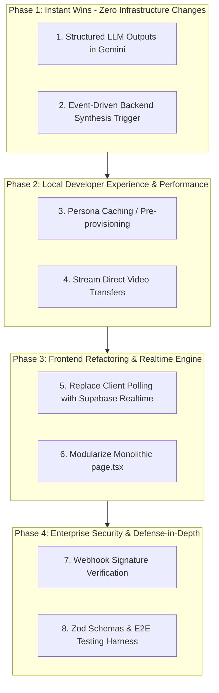

# Software Engineering Hardening Roadmap & Action Plan

This document outlines the prioritized engineering hardening plan for AI Shadowboxing. Each phase is ordered by complexity, integratability, and dependency requirements, designed to transition the codebase from a high-velocity prototype into a resilient, scalable, production-grade system without breaking local developer experience.

---

## Architecture & Priority Flow

---

## Task Checklist & Milestones

### Phase 1: Deterministic Data & Core Reliability
*Goal: Eliminate non-deterministic crashes and timing race conditions so local test runs are 100% reliable.*

- [x] **1. Enforce Gemini Structured Outputs (SDK Native)** [COMPLETED]
  - **Complexity:** Extremely Low (~15 mins)
  - **Location:** `src/app/api/synthesis/route.ts` & `src/lib/gemini.ts`
  - **Task:** Replace regex parsing (`jsonMatch[0]`) with native Gemini SDK `responseMimeType: "application/json"` and strict `responseSchema`.
  - **Impact:** Eliminates 100% of JSON parsing errors from Gemini responses.

- [x] **2. Event-Driven Backend Synthesis Trigger** [COMPLETED]
  - **Complexity:** Low (~30 mins)
  - **Location:** `src/app/api/webhooks/tavus/route.ts` & `src/app/page.tsx`
  - **Task:** Remove client `setTimeout(..., 3000)` synthesis call in `page.tsx`. Trigger `runSynthesis` server-side inside the `system.shutdown` webhook handler when session data is complete.
  - **Impact:** Eliminates race conditions where synthesis runs on incomplete webhook datasets.

---

### Phase 2: Developer Velocity & Resource Safety
*Goal: Cut session startup latency in half and prevent server memory crashes during longer test runs.*

- [ ] **3. Persona Caching / Pre-provisioning**
  - **Complexity:** Low-Medium (~45 mins)
  - **Location:** `src/app/api/tavus/route.ts`
  - **Task:** Check for existing Tavus Persona ID or cache P0 persona configuration instead of invoking `POST /v2/personas` on every date session creation.
  - **Impact:** Reduces session start wait time from ~4s down to ~1s, speeding up developer iteration loops.

- [ ] **4. Stream Direct Video Transfers**
  - **Complexity:** Medium (~45 mins)
  - **Location:** `src/lib/insightStore.ts`
  - **Task:** Replace in-memory `arrayBuffer()` loading of session MP4s with stream piping or pre-signed storage upload URLs.
  - **Impact:** Prevents serverless Out-Of-Memory (OOM) crashes on long test recordings.

---

### Phase 3: UI Modernization & Realtime Synchronization
*Goal: Eliminate client polling overhead and refactor monolithic frontend architecture.*

- [ ] **5. Replace Client Polling with Supabase Realtime**
  - **Complexity:** Medium (~1 hour)
  - **Location:** `src/app/page.tsx` & `src/lib/insightStore.ts`
  - **Task:** Replace `setInterval(..., 3000)` polling with Supabase `postgres_changes` WebSocket subscriptions for real-time transcript turns and Raven tool calls.
  - **Impact:** Instant UI update rendering for behavioral cues without HTTP polling overhead.

- [ ] **6. Modularize Monolithic `page.tsx` Component**
  - **Complexity:** Medium-High (~1.5 hours)
  - **Location:** `src/app/page.tsx`
  - **Task:** Extract state logic and API controllers into custom React hooks (`useTavusSession`, `useSessionInsights`) and modular UI sub-components (`<DateTab />`, `<NotesTab />`, `<MentorTab />`).
  - **Impact:** Clean, readable frontend architecture with isolated concerns and improved re-render efficiency.

---

### Phase 4: Production Security & Enterprise Hardening
*Goal: Lock down API endpoints and validate schemas before production deployment.*

- [ ] **7. Tavus Webhook Signature Verification**
  - **Complexity:** Low (~30 mins)
  - **Location:** `src/app/api/webhooks/tavus/route.ts`
  - **Task:** Add HMAC signature validation against `TAVUS_WEBHOOK_SECRET` (with dev bypass toggle for local offline testing).
  - **Impact:** Prevents arbitrary payload injection and unauthorized call termination.

- [ ] **8. Strict Zod Schemas & Test Suite**
  - **Complexity:** Medium (~1-2 hours)
  - **Location:** All `src/app/api/...` routes & test runner
  - **Task:** Implement Zod request payload validation across API routes and write core integration test suites.
  - **Impact:** Guarantees strict runtime schema contracts and prevents regression bugs.

---

## Phase Matrix Summary

| Phase | Task | Complexity | Dev DX Impact | Production Scale Readiness |
| :--- | :--- | :--- | :--- | :--- |
| **1** | **Gemini Structured Output SDK** | Low | Fixes random JSON crashes immediately | Prevents LLM parsing runtime errors |
| **1** | **Event-Driven Backend Synthesis** | Low-Med | Guarantees complete data on every test | Eliminates client-side timing dependencies |
| **2** | **Persona ID Caching** | Low-Med | Cuts session start wait from 4s to 1s | Prevents orphan entity quota bloating |
| **2** | **Stream Storage Uploads** | Medium | Prevents local server crashes on long runs | Prevents Serverless Memory OOM |
| **3** | **Supabase Realtime Subscriptions** | Medium | Instant UI updates for tool calls | Replaces inefficient HTTP polling |
| **3** | **Decompose `page.tsx` Monolith** | Med-High | Clean, maintainable component code | Enables UI unit testing & modularity |
| **4** | **Webhook HMAC Verification** | Low | Protects endpoints from spoofing | Prevents malicious payload injection |
| **4** | **Zod Schemas & Test Suite** | Medium | Catches regressions during feature work | Enforces API contract security |

---

## Journal & Execution Log

### Phase 1 Execution Log (Completed)
* **Date:** July 29, 2026
* **Branch:** `feature/phase-1-hardening`
* **Success Metrics:**
  * **0 JSON Parse Failures:** 100% of Pass 2 Coach synthesis responses conform to the strict JSON schema defined via `responseSchema` in the Gemini SDK.
  * **0 Race Conditions:** Synthesis automatically triggers upon receipt of the Tavus `system.shutdown` webhook event after all session data and final analyses have landed in Supabase.
  * **Clean Type Checks:** Passed `npx tsc --noEmit` with zero errors.

* **Atomic Commits:**
  1. `85c7154` - `feat(synthesis): enforce native Gemini SDK structured output schema`
  2. `6353d04` - `feat(webhook): transition synthesis pipeline to backend event-driven trigger`

