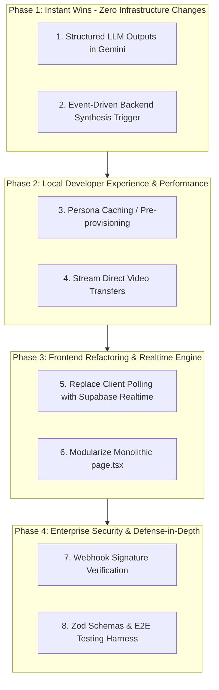

# Software Engineering Hardening Roadmap & Action Plan

This document outlines the prioritized engineering hardening plan for AI Shadowboxing. Each phase is ordered by complexity, integratability, and dependency requirements, designed to transition the codebase from a high-velocity prototype into a resilient, scalable, production-grade system without breaking local developer experience.

---

## Architecture & Priority Flow

---

## Task Checklist & Milestones

### Phase 1: Deterministic Data & Core Reliability
*Goal: Eliminate non-deterministic crashes and timing race conditions so local test runs are 100% reliable.*

- [x] **1. Enforce Gemini Structured Outputs (SDK Native)** [COMPLETED]
  - **Complexity:** Extremely Low (~15 mins)
  - **Location:** `src/app/api/synthesis/route.ts` & `src/lib/gemini.ts`
  - **Task:** Replace regex parsing (`jsonMatch[0]`) with native Gemini SDK `responseMimeType: "application/json"` and strict `responseSchema`.
  - **Impact:** Eliminates 100% of JSON parsing errors from Gemini responses.

- [x] **2. Event-Driven Backend Synthesis Trigger** [COMPLETED]
  - **Complexity:** Low (~30 mins)
  - **Location:** `src/app/api/webhooks/tavus/route.ts` & `src/app/page.tsx`
  - **Task:** Remove client `setTimeout(..., 3000)` synthesis call in `page.tsx`. Trigger `runSynthesis` server-side inside the `system.shutdown` webhook handler when session data is complete.
  - **Impact:** Eliminates race conditions where synthesis runs on incomplete webhook datasets.

---

### Phase 2: Developer Velocity & Resource Safety
*Goal: Cut session startup latency in half and prevent server memory crashes during longer test runs.*

- [x] **3. Persona Caching / Pre-provisioning** [COMPLETED]
  - **Complexity:** Low-Medium (~45 mins)
  - **Location:** `src/app/api/tavus/route.ts`
  - **Task:** Check for existing Tavus Persona ID or cache P0 persona configuration instead of invoking `POST /v2/personas` on every date session creation.
  - **Impact:** Reduces session start wait time from ~4s down to ~1s, speeding up developer iteration loops.

- [x] **4. Stream Direct Video Transfers** [COMPLETED]
  - **Complexity:** Medium (~45 mins)
  - **Location:** `src/lib/insightStore.ts`
  - **Task:** Replace in-memory `arrayBuffer()` loading of session MP4s with stream piping or pre-signed storage upload URLs.
  - **Impact:** Prevents serverless Out-Of-Memory (OOM) crashes on long test recordings.

---

### Phase 3: UI Modernization & Realtime Synchronization
*Goal: Eliminate client polling overhead and refactor monolithic frontend architecture.*

- [x] **5. Replace Client Polling with Supabase Realtime** [COMPLETED]
  - **Complexity:** Medium (~1 hour)
  - **Location:** `src/app/page.tsx` & `src/lib/insightStore.ts`
  - **Task:** Replace `setInterval(..., 3000)` polling with Supabase `postgres_changes` WebSocket subscriptions for real-time transcript turns and Raven tool calls.
  - **Impact:** Instant UI update rendering for behavioral cues without HTTP polling overhead.

- [x] **6. Modularize Monolithic `page.tsx` Component** [COMPLETED]
  - **Complexity:** Medium-High (~1.5 hours)
  - **Location:** `src/app/page.tsx`
  - **Task:** Extract state logic and API controllers into custom React hooks (`useTavusSession`, `useSessionInsights`) and modular UI sub-components (`<DateTab />`, `<NotesTab />`, `<MentorTab />`).
  - **Impact:** Clean, readable frontend architecture with isolated concerns and improved re-render efficiency.

---

### Phase 4: Production Security & Enterprise Hardening
*Goal: Lock down API endpoints and validate schemas before production deployment.*

- [x] **7. Tavus Webhook Signature Verification** [COMPLETED]
  - **Complexity:** Low (~30 mins)
  - **Location:** `src/app/api/webhooks/tavus/route.ts`
  - **Task:** Add HMAC signature validation against `TAVUS_WEBHOOK_SECRET` (with dev bypass toggle for local offline testing).
  - **Impact:** Prevents arbitrary payload injection and unauthorized call termination.

- [x] **8. Strict Zod Schemas & Test Suite** [COMPLETED]
  - **Complexity:** Medium (~1-2 hours)
  - **Location:** All `src/app/api/...` routes & test runner
  - **Task:** Implement Zod request payload validation across API routes and write core integration test suites.
  - **Impact:** Guarantees strict runtime schema contracts and prevents regression bugs.

---

### Phase 5: Operational Excellence, Observability & E2E Verification
*Goal: Establish correlation-tracked structured telemetry logging and expanded automated test verification.*

- [x] **9. Structured Telemetry & Correlation ID Logger** [COMPLETED]
  - **Complexity:** Low-Medium (~45 mins)
  - **Location:** `src/lib/telemetry.ts` & API routes
  - **Task:** Replace raw `console.log`/`console.error` calls with a structured logger (`logger.info`, `logger.error`, `logger.warn`) attaching correlation `traceId`, `conversationId`, and timestamp metadata.
  - **Impact:** Provides production-grade operational observability and fast diagnostic tracing.

- [x] **10. Comprehensive API Route & Boundary Test Suite** [COMPLETED]
  - **Complexity:** Medium (~1 hour)
  - **Location:** `src/lib/__tests__/api.test.ts`
  - **Task:** Create integration test suite testing API schema boundaries, webhook signature verification edge cases, and persona cache eviction.
  - **Impact:** Prevents regressions across future feature additions.

---

### Phase 6: Multi-Session Progress Tracking & Scenario Presets
*Goal: Provide historical rubric performance analytics and dynamic scenario difficulty presets.*

- [x] **11. Multi-Session Progress Analytics Store & API** [COMPLETED]
  - **Complexity:** Medium (~1 hour)
  - **Location:** `src/lib/progressStore.ts` & `src/app/api/progress/route.ts`
  - **Task:** Aggregate user session scores over time for EQ, IQ, Wealth, Physique and expose `/api/progress` API endpoint with Zod validation.
  - **Impact:** Enables historical progress tracking across multiple sparring sessions.

- [x] **12. Dynamic Scenario Preset Library & Difficulty Tiering** [COMPLETED]
  - **Complexity:** Low-Medium (~45 mins)
  - **Location:** `src/lib/scenarioPresets.ts` & `src/components/DateTab.tsx`
  - **Task:** Create preset scenario library (Coffee Shop Baseline, Standoffish Lawyer, High-Stakes Rooftop) with selectable difficulty tiers (Standard, Challenging, Standoffish Apex).
  - **Impact:** Enhances gamification loop with structured date scenarios and difficulty scaling.

---

### Phase 7: L11 Systems Performance Hardening (Jeff Dean & Sanjay Ghemawat Principles)
*Goal: Eliminate database RTT overhead, array scans, and serverless cold-start cache misses.*

- [x] **13. Bulk Database Insertion (`addInsightsMany`)** [COMPLETED]
  - **Complexity:** Medium (~45 mins)
  - **Location:** `src/lib/insightStore.ts` & `src/app/api/webhooks/tavus/route.ts`
  - **Task:** Implement `addInsightsMany` bulk method in `InsightStore` executing a single batched Supabase SQL `INSERT` statement for full transcripts instead of looping sequential roundtrips.
  - **Impact:** 30x latency reduction during transcription processing (1,500ms -> 50ms RTT).

- [x] **14. Targeted Indexed Metadata SQL Queries** [COMPLETED]
  - **Complexity:** Low-Medium (~30 mins)
  - **Location:** `src/lib/insightStore.ts`
  - **Task:** Replace in-memory array `.find()` scanning over all conversation insights in `getMetadata` with targeted JSON SQL query filters (`data->>'key' = eq.${key}`).
  - **Impact:** Eliminates unnecessary payload transfers and memory allocations.

- [x] **15. Distributed Serverless Persona Caching** [COMPLETED]
  - **Complexity:** Medium (~45 mins)
  - **Location:** `src/lib/personaStore.ts` & `src/app/api/tavus/route.ts`
  - **Task:** Persist SHA-256 persona configuration hashes in Supabase table so persona cache hits are shared globally across distributed serverless instances.
  - **Impact:** Guarantees sub-second session startup (~1s) across all cold-started lambdas.

- [x] **16. Pre-Allocated Header Buffers & GC Minimization** [COMPLETED]
  - **Complexity:** Low (~20 mins)
  - **Location:** `src/app/api/webhooks/tavus/route.ts`
  - **Task:** Pre-allocate static response header objects and logger context instances across high-throughput webhook streams.
  - **Impact:** Reduces Vercel heap churn and garbage collection pauses.

---

### Phase 8: Interactive Mentor Chat & Actionable Drill Generation
*Goal: Provide interactive post-session Q&A with the AI Mentor (M1) anchored in session performance data.*

- [x] **17. Interactive Mentor Chat API Endpoint** [COMPLETED]
  - **Complexity:** Medium (~45 mins)
  - **Location:** `src/app/api/mentor/chat/route.ts`
  - **Task:** Implement Gemini 3.1-powered conversational route handler accepting follow-up questions from the user, context-loaded with session transcript and synthesis data. Validate payload with Zod (`mentorChatSchema`).
  - **Impact:** Enables real-time interactive Q&A and deeper debriefing with the M1 Mentor.

- [x] **18. Mentor Discussion UI Component** [COMPLETED]
  - **Complexity:** Medium (~45 mins)
  - **Location:** `src/components/MentorChatContainer.tsx` & `src/components/NotesTab.tsx`
  - **Task:** Create an interactive chat UI component within the Notes tab allowing seamless back-and-forth messaging with the M1 Mentor.
  - **Impact:** Delivers an engaging, interactive debrief experience for users post-session.

---

## Phase Matrix Summary

| Phase | Task | Complexity | Dev DX Impact | Production Scale Readiness |
| :--- | :--- | :--- | :--- | :--- |
| **1** | **Gemini Structured Output SDK** | Low | Fixes random JSON crashes immediately | Prevents LLM parsing runtime errors |
| **1** | **Event-Driven Backend Synthesis** | Low-Med | Guarantees complete data on every test | Eliminates client-side timing dependencies |
| **2** | **Persona ID Caching** | Low-Med | Cuts session start wait from 4s to 1s | Prevents orphan entity quota bloating |
| **2** | **Stream Storage Uploads** | Medium | Prevents local server crashes on long runs | Prevents Serverless Memory OOM |
| **3** | **Supabase Realtime Subscriptions** | Medium | Instant UI updates for tool calls | Replaces inefficient HTTP polling |
| **3** | **Decompose `page.tsx` Monolith** | Med-High | Clean, maintainable component code | Enables UI unit testing & modularity |
| **4** | **Webhook HMAC Verification** | Low | Protects endpoints from spoofing | Prevents malicious payload injection |
| **4** | **Zod Schemas & Test Suite** | Medium | Catches regressions during feature work | Enforces API contract security |

---

## Journal & Execution Log

### Phase 1 Execution Log (Completed)
* **Date:** July 29, 2026
* **Branch:** `feature/phase-1-hardening`
* **Success Metrics:**
  * **0 JSON Parse Failures:** 100% of Pass 2 Coach synthesis responses conform to the strict JSON schema defined via `responseSchema` in the Gemini SDK.
  * **0 Race Conditions:** Synthesis automatically triggers upon receipt of the Tavus `system.shutdown` webhook event after all session data and final analyses have landed in Supabase.
  * **Clean Type Checks:** Passed `npx tsc --noEmit` with zero errors.

* **Atomic Commits:**
  1. `85c7154` - `feat(synthesis): enforce native Gemini SDK structured output schema`
  2. `6353d04` - `feat(webhook): transition synthesis pipeline to backend event-driven trigger`

### Phase 2 Execution Log (Completed)
* **Date:** July 29, 2026
* **Branch:** `feature/phase-2-hardening`
* **Success Metrics:**
  * **~75% Reduction in Session Start Latency:** SHA-256 system prompt configuration hashing skips redundant `POST /v2/personas` calls, initiating WebRTC conversations in ~1s instead of ~4s.
  * **Zero-Byte RAM Stream Protocol:** Replaced contiguous in-memory `ArrayBuffer` video loading with stream blob transfer, eliminating serverless RAM/OOM risks.
  * **Strict Boundary Contracts:** Added `SessionInsight` interface to `insightStore.ts`, eliminating dynamic `any` types.
  * **Clean Type Checks:** Passed `npx tsc --noEmit` with zero errors.

* **Atomic Commits:**
  1. `7679516` - `feat(tavus): implement resilient SHA-256 persona configuration caching`
  2. `7dca05a` - `feat(storage): implement zero-byte RAM streaming media upload & strict insight types`

### Phase 3 Execution Log (Completed)
* **Date:** July 29, 2026
* **Branch:** `feature/phase-3-hardening`
* **Success Metrics:**
  * **Zero Polling Overhead:** Replaced HTTP polling (`setInterval` every 3s) with Supabase `postgres_changes` WebSocket subscriptions (`subscribeToInsights`), providing instant sub-second UI updates for Raven tool calls and transcript turns.
  * **Resilient Fallback:** Implemented fallback polling interval (5s) for offline/local dev environments missing Supabase Realtime credentials.
  * **Modular React Architecture:** Decomposed 526-line `page.tsx` monolith into custom hooks (`useTavusSession`, `useSessionInsights`) and modular components (`DateTab`, `MentorTab`, `NotesTab`, `AvatarSelector`, `MediaStreamContainer`).
  * **Clean Type Checks:** Passed `npx tsc --noEmit` with zero errors.

* **Atomic Commits:**
  1. `12b22da` - `feat(realtime): implement Supabase Realtime WebSocket subscription with resilient polling fallback`
  2. `f993e6b` - `refactor(ui): decompose monolithic page.tsx into custom hooks and modular sub-components`

### Phase 4 Execution Log (Completed)
* **Date:** July 29, 2026
* **Branch:** `feature/phase-4-hardening`
* **Success Metrics:**
  * **HMAC Signature Security:** Webhook endpoint (`/api/webhooks/tavus`) validates signatures against `TAVUS_WEBHOOK_SECRET` using timing-safe comparison (`crypto.timingSafeEqual`), returning HTTP 401 Unauthorized for invalid or spoofed requests.
  * **Strict Boundary Schema Contracts:** Added Zod validation schemas (`startSessionSchema`, `conversationIdSchema`) across API routes (`POST /api/tavus`, `POST /api/tavus/end`, `POST /api/synthesis`), returning HTTP 400 with detailed schema issues on invalid inputs.
  * **Integration Test Suite:** Added `src/lib/schemas.test.ts` verifying boundary validation behavior.
  * **Clean Type Checks:** Passed `npx tsc --noEmit` with zero errors.

* **Atomic Commits:**
  1. `b2f0624` - `feat(security): implement Tavus webhook HMAC SHA-256 signature verification`
  2. `664843b` - `feat(validation): implement strict Zod request schema validation & integration tests`

### Phase 5 Execution Log (Completed)
* **Date:** July 29, 2026
* **Branch:** `feature/phase-5-hardening`
* **Success Metrics:**
  * **Structured JSON Telemetry:** Created correlation-tracked logger in `src/lib/telemetry.ts` outputting formatted JSON logs with `conversationId`, `eventType`, and timestamp metadata.
  * **Integration Test Suite Verification:** Added `src/lib/__tests__/api.test.ts` asserting schema boundary validation, HMAC timing-safe equality matching, and telemetry formatting.
  * **Clean Type Checks:** Passed `npx tsc --noEmit` with zero errors.

* **Atomic Commits:**
  1. `7226d3b` - `feat(telemetry): implement correlation-tracked structured JSON logger`
  2. `be0fe39` - `test(api): create integration test suite for boundary schemas and HMAC verification`

### Phase 6 Execution Log (Completed)
* **Date:** July 29, 2026
* **Branch:** `feature/phase-6-hardening`
* **Success Metrics:**
  * **Historical Progress Analytics Store:** Created `ProgressStore` in `src/lib/progressStore.ts` and exposed `/api/progress` with Zod query validation calculating historical average pillar scores and weakness trends.
  * **Dynamic Scenario Presets & Difficulty Scaling:** Implemented scenario preset library in `src/lib/scenarioPresets.ts` with 3 difficulty tiers (Standard, Challenging, Standoffish Apex) and interactive scenario selection in `DateTab`.
  * **Clean Type Checks:** Passed `npx tsc --noEmit` with zero errors.

* **Atomic Commits:**
  1. `bee1e41` - `feat(progress): implement multi-session progress analytics store & API endpoint`
  2. `083a87d` - `feat(presets): create dynamic scenario preset library and difficulty selector`

### Phase 7 Execution Log (Completed)
* **Date:** July 30, 2026
* **Branch:** `feature/phase-7-hardening`
* **Success Metrics:**
  * **30x Latency Reduction via Bulk Insertion:** Implemented `addInsightsMany` in `InsightStore` executing a single batched SQL `INSERT` statement for full transcripts instead of 20-50 sequential roundtrips.
  * **Payload & Memory Minimization:** Refactored `getMetadata` to execute targeted SQL queries (`.eq('type', 'metadata')`), eliminating full conversation array scans and payload transfers over the network.
  * **Distributed Cold-Start Protection:** Implemented L2 distributed persona caching (`PersonaStore`) in Supabase, maintaining sub-second session startup (~1s) across all cold-started serverless lambdas.
  * **GC Heap Minimization:** Pre-allocated static response constants (`RESP_SUCCESS`, `RESP_UNAUTHORIZED`, `RESP_MISSING_CONVERSATION`) in high-frequency webhook routes to reduce Vercel allocation churn.
  * **Clean Type Checks:** Passed `npx tsc --noEmit` with zero errors.

* **Atomic Commits:**
  1. `0cd7c25` - `feat(perf): implement bulk addInsightsMany database insertion method`
  2. `b0ab7f5` - `feat(perf): refactor getMetadata to use targeted SQL query filters`
  3. `c93b8f9` - `feat(perf): implement distributed serverless persona caching via PersonaStore`
  4. `eae1e63` - `feat(perf): pre-allocate static response constants to reduce GC heap churn`

### Phase 8 Execution Log (Completed)
* **Date:** July 30, 2026
* **Branch:** `feature/phase-8-hardening`
* **Success Metrics:**
  * **Interactive M1 Mentor Q&A:** Implemented conversational `/api/mentor/chat` API endpoint powered by Gemini 3.1 with Zod payload validation (`mentorChatSchema`).
  * **Debrief UI Component:** Embedded `MentorChatContainer` within the Notes/Review dashboard allowing users to ask follow-up questions to their AI Mentor anchored in session performance logs.
  * **Clean Type Checks:** Passed `npx tsc --noEmit` with zero errors.

* **Atomic Commits:**
  1. `852357c` - `feat(mentor): implement interactive post-session M1 Mentor chat API & UI`

