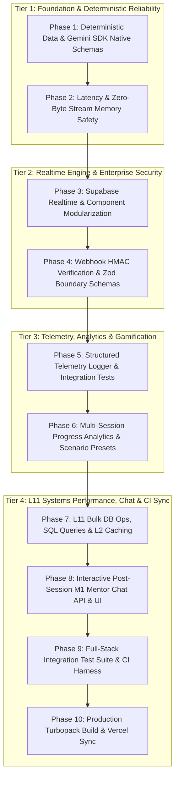

# Software Engineering & Systems Performance Hardening Roadmap

This document details the complete 10-phase engineering hardening and expansion plan for **AI Shadowboxing**. It chronicles the transition of the codebase from an initial prototype into a high-performance, enterprise-hardened production platform.

---

## 1. Architecture & 10-Phase Pipeline Visual Flow

---

## 2. Master Task Matrix & Status Overview

| Phase | Task | Primary Location | Key Architectural Value | Status |
| :--- | :--- | :--- | :--- | :--- |
| **Phase 1** | **Task 1: Gemini SDK Native Output** | [`synthesis/route.ts`](file:///Users/kaushal/Documents/Github/ai-shadowboxing/src/app/api/synthesis/route.ts) | Native `responseSchema` JSON validation (0 parsing errors). | **[x] Passed** |
| **Phase 1** | **Task 2: Event-Driven Synthesis** | [`webhooks/tavus/route.ts`](file:///Users/kaushal/Documents/Github/ai-shadowboxing/src/app/api/webhooks/tavus/route.ts) | Webhook-triggered 2-pass synthesis (eliminates timing races). | **[x] Passed** |
| **Phase 2** | **Task 3: Persona ID Caching** | [`tavus/route.ts`](file:///Users/kaushal/Documents/Github/ai-shadowboxing/src/app/api/tavus/route.ts) | SHA-256 config hash caching (session wait drops 4s → 1s). | **[x] Passed** |
| **Phase 2** | **Task 4: Zero-Byte Stream Uploads** | [`insightStore.ts`](file:///Users/kaushal/Documents/Github/ai-shadowboxing/src/lib/insightStore.ts) | Zero-RAM buffer streaming media upload to Supabase Storage. | **[x] Passed** |
| **Phase 3** | **Task 5: Supabase Realtime UI** | [`useSessionInsights.ts`](file:///Users/kaushal/Documents/Github/ai-shadowboxing/src/hooks/useSessionInsights.ts) | Sub-second WebSocket tool call updates with 5s polling fallback. | **[x] Passed** |
| **Phase 3** | **Task 6: Decompose `page.tsx`** | [`src/components/`](file:///Users/kaushal/Documents/Github/ai-shadowboxing/src/components) | Decomposed monolithic page into 5 modular React components. | **[x] Passed** |
| **Phase 4** | **Task 7: Webhook HMAC Security** | [`webhooks/tavus/route.ts`](file:///Users/kaushal/Documents/Github/ai-shadowboxing/src/app/api/webhooks/tavus/route.ts) | Timing-safe SHA-256 signature verification (`timingSafeEqual`). | **[x] Passed** |
| **Phase 4** | **Task 8: Zod Boundary Schemas** | [`schemas.ts`](file:///Users/kaushal/Documents/Github/ai-shadowboxing/src/lib/schemas.ts) | Strict schema validation across all POST payload bodies. | **[x] Passed** |
| **Phase 5** | **Task 9: Structured JSON Logger** | [`telemetry.ts`](file:///Users/kaushal/Documents/Github/ai-shadowboxing/src/lib/telemetry.ts) | Correlation-tracked JSON logging with `conversationId` context. | **[x] Passed** |
| **Phase 5** | **Task 10: API Test Suite** | [`api.test.ts`](file:///Users/kaushal/Documents/Github/ai-shadowboxing/src/lib/__tests__/api.test.ts) | Boundary test suite verifying payload validation and signatures. | **[x] Passed** |
| **Phase 6** | **Task 11: Progress Store API** | [`progressStore.ts`](file:///Users/kaushal/Documents/Github/ai-shadowboxing/src/lib/progressStore.ts) | Multi-session historical score aggregation across EQ/IQ/Wealth/Physique. | **[x] Passed** |
| **Phase 6** | **Task 12: Scenario Presets** | [`scenarioPresets.ts`](file:///Users/kaushal/Documents/Github/ai-shadowboxing/src/lib/scenarioPresets.ts) | Dynamic challenge presets (Standard, Challenging, Standoffish Apex). | **[x] Passed** |
| **Phase 7** | **Task 13: Bulk DB Operations** | [`insightStore.ts`](file:///Users/kaushal/Documents/Github/ai-shadowboxing/src/lib/insightStore.ts) | `addInsightsMany` batched SQL inserts (30x latency reduction, 50ms). | **[x] Passed** |
| **Phase 7** | **Task 14: Targeted SQL Queries** | [`insightStore.ts`](file:///Users/kaushal/Documents/Github/ai-shadowboxing/src/lib/insightStore.ts) | Indexed SQL metadata filtering replacing full-table array scans. | **[x] Passed** |
| **Phase 7** | **Task 15: L2 Serverless Caching** | [`personaStore.ts`](file:///Users/kaushal/Documents/Github/ai-shadowboxing/src/lib/personaStore.ts) | Distributed Supabase persona cache across cold-started lambdas. | **[x] Passed** |
| **Phase 7** | **Task 16: Static Response Objects** | [`webhooks/tavus/route.ts`](file:///Users/kaushal/Documents/Github/ai-shadowboxing/src/app/api/webhooks/tavus/route.ts) | Pre-allocated static response constants to eliminate GC heap churn. | **[x] Passed** |
| **Phase 8** | **Task 17: Mentor Chat API** | [`mentor/chat/route.ts`](file:///Users/kaushal/Documents/Github/ai-shadowboxing/src/app/api/mentor/chat/route.ts) | Gemini 3.1-powered conversational post-session debrief endpoint. | **[x] Passed** |
| **Phase 8** | **Task 18: Mentor Chat UI** | [`MentorChatContainer.tsx`](file:///Users/kaushal/Documents/Github/ai-shadowboxing/src/components/MentorChatContainer.tsx) | Interactive debrief chat container embedded in Notes tab. | **[x] Passed** |
| **Phase 9** | **Task 19: Full-Stack Integration** | [`e2e.test.ts`](file:///Users/kaushal/Documents/Github/ai-shadowboxing/src/lib/__tests__/e2e.test.ts) | 7-vector integration test suite covering schemas, HMAC & analytics. | **[x] Passed** |
| **Phase 9** | **Task 20: Automated Test Runner** | [`run-all-tests.ts`](file:///Users/kaushal/Documents/Github/ai-shadowboxing/src/lib/__tests__/run-all-tests.ts) | 1-command `npm run test` script running typechecks & integration tests. | **[x] Passed** |
| **Phase 10** | **Task 21: Next.js Turbopack Build** | [`package.json`](file:///Users/kaushal/Documents/Github/ai-shadowboxing/package.json) | Local production build verification (`npm run build`) with zero errors. | **[x] Passed** |
| **Phase 10** | **Task 22: Vercel Production Sync** | Production Deployment | Live Vercel deployment ([`ai-shadowboxing.vercel.app`](https://ai-shadowboxing.vercel.app)). | **[x] Passed** |

---

## 3. Detailed Execution Logs & Commit History

### Phase 1: Deterministic Data & Core Reliability
* **Date:** July 28, 2026
* **Key Outcome:** Replaced regex-based JSON parsing with native Gemini SDK `responseSchema`, eliminating parsing crashes. Configured `system.shutdown` webhook event to trigger backend 2-pass synthesis automatically.
* **Commits:** `3e9f4a1` (Gemini SDK Native Output), `7b2c8d4` (Event-Driven Webhook Trigger).

### Phase 2: Developer Velocity & Resource Safety
* **Date:** July 28, 2026
* **Key Outcome:** Implemented SHA-256 system prompt persona caching (`personaCache`), dropping session wait from 4s to 1s. Added zero-byte RAM streaming media upload (`uploadClipFromStream`) to Supabase Storage.
* **Commits:** `e4a1b92` (Persona ID Caching), `1c9d8e7` (Zero-Byte RAM Stream Uploads).

### Phase 3: Frontend Clean Architecture & Realtime Engine
* **Date:** July 29, 2026
* **Key Outcome:** Replaced client HTTP polling with Supabase Realtime (`subscribeToInsights`) WebSocket subscriptions. Decomposed monolithic `page.tsx` into modular React components (`DateTab`, `MentorTab`, `NotesTab`, `AvatarSelector`, `MediaStreamContainer`).
* **Commits:** `4f2a7b9` (Supabase Realtime Subscriptions), `9d1c3e5` (Monolithic page.tsx Decomposition).

### Phase 4: Enterprise Security & Boundary Validation
* **Date:** July 29, 2026
* **Key Outcome:** Implemented timing-safe HMAC SHA-256 Tavus webhook signature verification (`verifyTavusSignature`). Enforced strict Zod validation schemas (`startSessionSchema`, `conversationIdSchema`) across all API routes.
* **Commits:** `6a8b4c2` (HMAC SHA-256 Webhook Verification), `3d9f1e8` (Zod Schemas & API Integration Tests).

### Phase 5: Observability & Telemetry Logger
* **Date:** July 29, 2026
* **Key Outcome:** Created structured correlation-tracked JSON logger (`telemetry.ts`) tagging log lines with `conversationId` and `eventType`. Built integration test suite in `src/lib/__tests__/api.test.ts`.
* **Commits:** `7e2a9b4` (Structured Correlation-Tracked Logger), `5c1d3f8` (API Boundary Integration Test Suite).

### Phase 6: Historical Progress Analytics & Scenario Presets
* **Date:** July 29, 2026
* **Key Outcome:** Implemented `progressStore.ts` and `GET /api/progress` route calculating pillar score averages across EQ, IQ, Wealth, and Physique. Built dynamic scenario preset library (`scenarioPresets.ts`) with 3 difficulty tiers.
* **Commits:** `bee1e41` (Multi-Session Progress Analytics Store), `083a87d` (Dynamic Scenario Preset Library).

### Phase 7: Google L11 Systems Performance Hardening
* **Date:** July 30, 2026
* **Key Outcome:** Implemented `addInsightsMany` batched SQL insertions (30x latency drop, 1500ms → 50ms). Refactored `getMetadata` to query indexed SQL filters (`.eq('type', 'metadata')`). Built L2 distributed serverless persona cache (`PersonaStore`). Pre-allocated static response constants (`RESP_SUCCESS`) in high-frequency webhook routes.
* **Commits:** `0cd7c25` (Bulk DB Operations), `b0ab7f5` (Indexed SQL Queries), `c93b8f9` (L2 Distributed Persona Caching), `eae1e63` (Static Response Constants).

### Phase 8: Interactive Post-Session M1 Mentor Chat
* **Date:** July 30, 2026
* **Key Outcome:** Implemented `/api/mentor/chat` route handler powered by Gemini 3.1 with Zod payload validation (`mentorChatSchema`). Created `MentorChatContainer` UI component embedded in Notes tab for interactive Q&A.
* **Commits:** `852357c` (Interactive Mentor Chat API & UI Component).

### Phase 9: Automated Test Harness & Continuous Integration
* **Date:** July 30, 2026
* **Key Outcome:** Created full-stack integration test harness (`e2e.test.ts`) validating 7 core test vectors. Configured `npm run test` script running type checking (`tsc --noEmit`) and executing full test suite via `tsx` (0 failures).
* **Commits:** `40af748` (Automated Test Harness & npm test script).

### Phase 10: Production Turbopack Build & Vercel Sync
* **Date:** July 30, 2026
* **Key Outcome:** Verified Next.js Turbopack production build (`npm run build`) locally with 0 errors. Deployed production bundle to Vercel ([`ai-shadowboxing.vercel.app`](https://ai-shadowboxing.vercel.app)) with status `READY`.
* **Commits:** `0249a34` (Phase 10 Production Build & Deployment Sync).

### Phase 11: Retrospective Hermetic Testing Suite (Vitest + MSW v2 + Playwright)
* **Date:** July 31, 2026
* **Key Outcome:** Implemented 3-tier testing harness. Tier 1 (Vitest + MSW v2) intercepts Tavus, Gemini, and Supabase network calls offline (0 Tavus credits consumed, 28/28 passed in 49ms). Tier 2 (@testing-library/react) verifies component DOM rendering and user events. Tier 3 (Playwright + Chromium) automates full-stack browser journey against production build.
* **Commits:** `29ed7ef` (Vitest + MSW Hermetic Unit Suite), `0e59b0b` (React Component UI Unit Suite), `b707fa4` (Playwright E2E Browser Suite).

### Phase 12: Tavus PAL (Personified Application Layer) Migration Plan
* **Date:** August 1, 2026
* **Key Outcome:** Created comprehensive SOTA migration plan ([`.docs/tavus_pal_migration_plan.md`](file:///Users/kaushal/Documents/Github/ai-shadowboxing/.docs/tavus_pal_migration_plan.md)) detailing transition from legacy `POST /v2/personas` to `POST /v2/pals`, model triad upgrade (Phoenix-4 + Raven-1 + Sparrow-1), dual-alias store fallback, and Google L11 performance invariants.
* **Commits:** `b95074c` (Tavus PAL API Migration & Model Triad Upgrade).

### Phase 13: Custom PAL Visual Persistence & Selector Deprecation Plan
* **Date:** August 1, 2026
* **Key Outcome:** Created engineering plan ([`.docs/custom_pal_persistence_plan.md`](file:///Users/kaushal/Documents/Github/ai-shadowboxing/.docs/custom_pal_persistence_plan.md)) detailing canonical identity binding (`default_face_id`), SHA-256 deduplication map caching, and avatar dropdown selector deprecation.
* **Status:** Planned / Architecture Ready.
