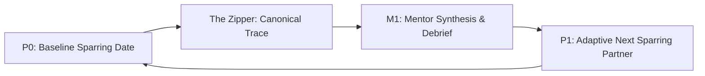

# Product Requirements: AI Shadowboxing

## 1. Vision & Overview
**AI Shadowboxing** is a gamified, ultra-realistic "first date" training simulator designed to help men build interpersonal composure, vocal stability, and conversational presence. By pairing photorealistic digital replicas with multimodal perception models, the simulator reacts in real time to *what* the user says and *how* they say it.

---

## 2. Core Gamification Loop: P0 → M1 → P1

The user experience centers on an iterative 3-stage loop:

### Stage 1: The Demo Sparring Session (P0 Baseline)
* **Goal:** Establish a baseline and test the user's composure under interpersonal pressure.
* **Mechanics:**
  * Sub-500ms video conversation with a photorealistic Tavus replica ([`src/components/MediaStreamContainer.tsx`](file:///Users/kaushal/Documents/Github/ai-shadowboxing/src/components/MediaStreamContainer.tsx)).
  * **Tavus Raven-1:** Continually monitors non-verbal cues (vocal jitter, eye contact, postural stiffness, validation-seeking stutter).
  * **Tavus Sparrow:** Handles natural turn-taking and dialogue rhythm grounded in high-value rubrics.

### Stage 2: Post-Session Context Distillation (The Zipper)
* **Canonical Trace Generation:** Google Gemini 3.1 Flash Lite ingests raw transcript and perception streams to create a timestamp-aligned **Master Performance Log (Markdown)** ([`src/app/api/synthesis/route.ts`](file:///Users/kaushal/Documents/Github/ai-shadowboxing/src/app/api/synthesis/route.ts)).
* **Rubric Tagging:** Every dialogue turn is paired with non-verbal perception signals tagged under EQ, IQ, Wealth, or Physique.

### Stage 3: Mentor Synthesis & Hedged Partner (M1 & P1)
* **M1 Mentor Debrief:** Provides a structured performance audit across the 4 pillars and identifies primary weaknesses.
* **Interactive Q&A:** User asks follow-up questions to M1 via [`MentorChatContainer.tsx`](file:///Users/kaushal/Documents/Github/ai-shadowboxing/src/components/MentorChatContainer.tsx).
* **P1 Next Partner Hedging:** Gemini automatically generates a specialized prompt for the next sparring partner (P1) designed to target the user's specific weaknesses (e.g., if the user over-compensated on status, P1 becomes more standoffish).

---

## 3. High-Value Rubrics Definition

1. **Emotional Intelligence (EQ):** Composure under pressure, absence of nervous stuttering or validation-seeking.
2. **Intellectual Quality (IQ):** Conversational depth, clarity of thought, intellectual rigor.
3. **Perceived Wealth & Status:** Lifestyle authenticity, career grounding, absence of over-compensation.
4. **Physique & Presence:** Posture, eye contact, vocal pitch stability, screen-based presence.
