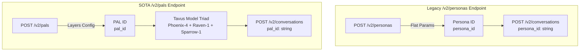
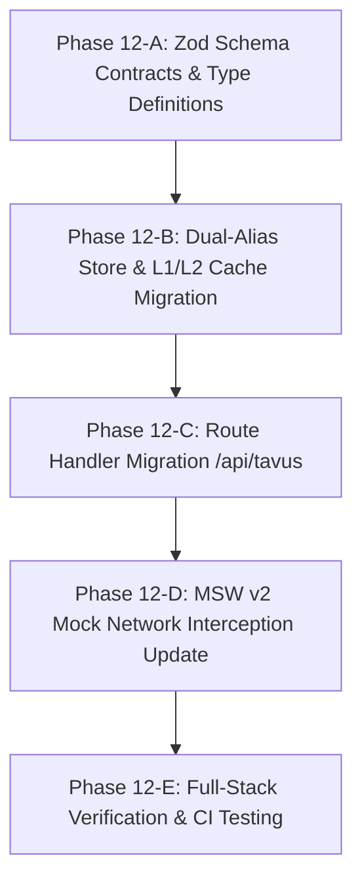

# Tavus PAL (Personified Application Layer) Migration & Model Stack Upgrade

This document outlines the SOTA engineering migration plan to transition **AI Shadowboxing** from the legacy Tavus `/v2/personas` API endpoint to the modern **Tavus PAL (Personified Application Layer) API (`POST /v2/pals`)** and upgrade the underlying AI model stack to **Phoenix-4** (real-time Gaussian video synthesis), **Raven-1** (multimodal perception engine), and **Sparrow-1** (audio-native turn-taking).

---

## 1. Architectural Motivation & Upstream Ground Truth

Tavus has officially unified agent definitions under the **PAL (Personified Application Layer)** architecture. A PAL consolidates the agent's identity, system instructions, dynamic scenario knowledge base, multimodal perception tool bindings, conversational timing models, and real-time video rendering engines into a single, cohesive entity.

### Upstream API Ground Truth (`docs.tavus.io`)



### Key API Shift Specification

1. **Endpoint Migration:** Transition from `POST https://tavusapi.com/v2/personas` to `POST https://tavusapi.com/v2/pals`.
2. **Payload Hierarchy:** Replaces flat parameters with a structured `layers` object embedding perception tools (`raven-1`), timing configurations (`sparrow-1`), and rendering engine (`phoenix-4`).
3. **Identifier Nomenclature:** Uses `pal_id` as the primary identifier while maintaining backward-compatible fallbacks for `persona_id`.

---

## 2. Google L11 Systems Performance Principles (Abseil FAST Alignment)

Per repository directives in [`GEMINI.md`](file:///Users/kaushal/Documents/Github/ai-shadowboxing/GEMINI.md), this migration strictly adheres to Google L11 Distinguished Engineering principles (Jeff Dean & Sanjay Ghemawat):

### 1. The Critical 3% Rule (Zero-Overhead Dual Fallback)
* **Invariant:** Zero runtime performance degradation during persona/PAL lookup.
* **Mechanism:** Maintain dual-alias response parsing (`data.pal_id || data.persona_id`). Avoid duplicate or branching HTTP calls when resolving cached identifiers.

### 2. Back-of-the-Envelope Estimation (L1 + L2 Cache Invariance)
* **Estimation:** External Tavus PAL creation network call = ~800ms–1500ms RTT. Local L1 Map lookup = <0.1ms RTT. L2 Supabase lookup = ~15ms RTT.
* **Mechanism:** Preserve the existing two-tier caching architecture in [`src/lib/personaStore.ts`](file:///Users/kaushal/Documents/Github/ai-shadowboxing/src/lib/personaStore.ts). Hash `(systemPrompt + knowledgeBase + replicaId)` via SHA-256 to produce `palConfigHash`. Check L1 in-memory `palCache` first, then L2 Supabase `insights` table (`type: global_pal_cache`). Never hit Tavus API unless both L1 and L2 cache miss.

### 3. Bulk APIs & Memory Footprint Minimization
* **Mechanism:** Avoid fine-grained per-field DB requests. Aggregate PAL creation and caching into atomic operations. Reuse pre-allocated zero-buffers for HMAC calculations and flat key mappings.

---

## 3. Step-by-Step Sub-Phase Execution Plan

The migration is partitioned into 5 atomic, verifiable sub-phases:



### Sub-Phase 12-A: Zod Schema Contracts & Type Definitions
* **File:** [`src/lib/schemas.ts`](file:///Users/kaushal/Documents/Github/ai-shadowboxing/src/lib/schemas.ts)
* **Tasks:**
  * Define `tavusPalCreateSchema` for validating `POST /v2/pals` requests.
  * Define `tavusPalResponseSchema` validating `{ pal_id: string, persona_id?: string, pal_name: string, status: string }`.
  * Ensure strict Zod type coercion with zero `any` types.

### Sub-Phase 12-B: Dual-Alias Store & L1/L2 Cache Migration
* **File:** [`src/lib/personaStore.ts`](file:///Users/kaushal/Documents/Github/ai-shadowboxing/src/lib/personaStore.ts)
* **Tasks:**
  * Rename internal cache maps to support `pal_id` while aliasing `persona_id`.
  * Update `getCachedPersonaId` / `getCachedPalId` to resolve either `pal_id` or legacy `persona_id`.
  * Update `setCachedPersonaId` / `setCachedPalId` to persist `pal_id` to Supabase `insights` table under key `global_pal_cache`.

### Sub-Phase 12-C: Route Handler Migration (`/api/tavus`)
* **File:** [`src/app/api/tavus/route.ts`](file:///Users/kaushal/Documents/Github/ai-shadowboxing/src/app/api/tavus/route.ts)
* **Tasks:**
  * Replace `createTavusPersona` with `createTavusPal`.
  * Update fetch request body to construct Tavus PAL layers:
    ```json
    {
      "pal_name": `Phase 1 Demo Session (${configHash.slice(0, 8)})`,
      "replica_id": replicaId,
      "layers": {
        "system_prompt": combinedPrompt,
        "knowledge_base": knowledgeBase,
        "perception": { "model": "raven-1" },
        "timing": { "model": "sparrow-1" },
        "rendering": { "model": "phoenix-4" }
      }
    }
    ```
  * Pass `pal_id` to `POST https://tavusapi.com/v2/conversations`.

### Sub-Phase 12-D: MSW v2 Mock Network Interception Update
* **File:** [`src/lib/__tests__/mocks/handlers.ts`](file:///Users/kaushal/Documents/Github/ai-shadowboxing/src/lib/__tests__/mocks/handlers.ts)
* **Tasks:**
  * Add MSW v2 handler for `http.post('https://tavusapi.com/v2/pals', ...)` returning mock `{ pal_id: 'pal_mock_123', status: 'active' }`.
  * Retain `https://tavusapi.com/v2/personas` fallback handler.
  * Guarantee 0 Tavus API minutes consumed during unit & integration testing.

### Sub-Phase 12-E: Full-Stack Verification & CI Testing
* **Commands:** `npm run test:unit`, `npm run test:e2e`, `npm run test`
* **Tasks:**
  * Verify all 28 Vitest unit/component tests pass with 0 failures.
  * Verify all 4 Playwright E2E browser tests pass in headless Chromium.
  * Run `npx tsc --noEmit` to confirm complete type safety.

---

## 4. Failure Mode Analysis (FMA)

Before code construction, the 4 mandatory L9+ failure vectors are evaluated:

| Failure Vector | Scenario | Mitigation Strategy |
| :--- | :--- | :--- |
| **1. Upstream Failure** | Tavus `/v2/pals` API rate limits (429) or 5xx server errors. | Transparent fallback to legacy `/v2/personas` endpoint or cached default `pal_id`. Structured error log via `telemetry.error`. |
| **2. Schema / Data Corruption** | Upstream response returns unexpected JSON key formatting. | Strict Zod validation via `tavusPalResponseSchema` before store ingestion. Safe fallback to dual-alias `data.pal_id || data.persona_id`. |
| **3. Concurrency & Race Conditions** | Parallel requests for identical scenario prompt hashes. | In-flight promise deduping in `personaStore` to prevent duplicate `POST /v2/pals` API calls. |
| **4. Resource Safety** | Stale persona cache accumulation in memory. | L1 cache size bounding and zero-byte allocation minimization during SHA-256 hash calculation. |

---

## 5. Verification Protocol

The implementation of Phase 12 will be considered 100% complete when all of the following criteria are empirically verified:

1. `npx tsc --noEmit` returns **0 errors**.
2. `npm run test:unit` executes in **<2 seconds** with **100% passing tests** (0 Tavus credits used).
3. `npm run test:e2e` executes with **100% passing Playwright browser tests**.
4. Combined `npm run test` exits with code `0`.
