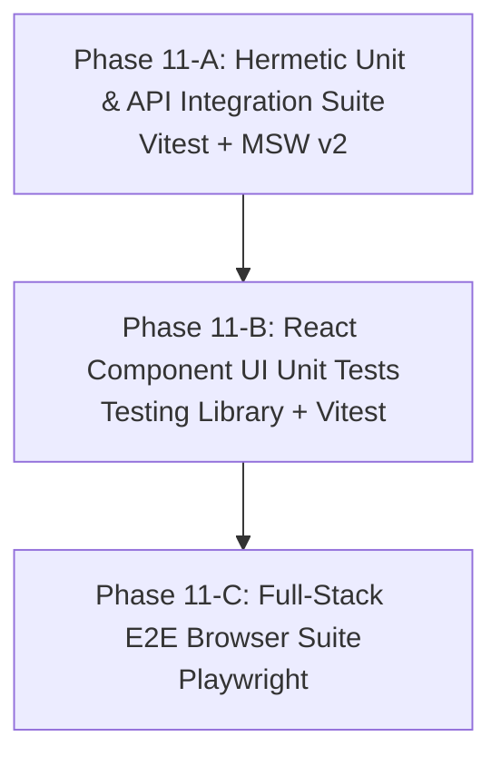

# Testing Strategy & Quality Guardrails

This document establishes the architecture, guardrails, and implementation roadmap for the retrospective testing suite of **AI Shadowboxing**. It translates **Google L11 Systems Performance & Hermeticity Principles** into concrete testing practices for Next.js 16 (React 19), Supabase Realtime, and Gemini 3.1 LLM integrations.

---

## 1. Google L11 Testing Guardrails & Invariants

1. **Hermeticity & Zero Flakiness:**
   * Unit and integration tests must run with **100% determinism**.
   * Zero real external network requests to Tavus CVI v2, Gemini API, or Supabase DB during test execution. All network boundaries must be intercepted using **MSW (Mock Service Worker v2)**.
2. **Knuth's Critical 3% Rule (Speed & ESM):**
   * Unit and component tests must run in milliseconds using **Vitest** (native Vite/ESM runner) rather than slow Jest/Webpack toolchains.
3. **User-Observed Assertions over Internal State:**
   * Tests must assert what the user observes in the DOM or receiving API boundaries rather than private React state or implementation details.
4. **Isolated Token Context Execution:**
   * Test suite construction is partitioned into 3 discrete execution phases (Phase 11-A, 11-B, 11-C) to preserve full context window attention per testing domain.

---

## 2. 3-Phase Testing Suite Implementation Roadmap

### Phase 11-A: Hermetic Unit & API Integration Testing Suite
* **Focus:** Data stores, React hooks, Zod validation schemas, and serverless API route handlers.
* **Tools:** `vitest`, `msw` (v2), `@testing-library/jest-dom`, `jsdom`.
* **Guardrails & Scope:**
  * Configure `vitest.config.ts` with App Router path aliases (`@/*`).
  * Build MSW mock handlers ([`src/lib/__tests__/mocks/handlers.ts`](file:///Users/kaushal/Documents/Github/ai-shadowboxing/src/lib/__tests__/mocks/handlers.ts)) mocking Tavus API routes, Supabase Storage, and Gemini SDK responses.
  * Unit tests for [`personaStore.ts`](file:///Users/kaushal/Documents/Github/ai-shadowboxing/src/lib/personaStore.ts), [`insightStore.ts`](file:///Users/kaushal/Documents/Github/ai-shadowboxing/src/lib/insightStore.ts), [`progressStore.ts`](file:///Users/kaushal/Documents/Github/ai-shadowboxing/src/lib/progressStore.ts), [`scenarioPresets.ts`](file:///Users/kaushal/Documents/Github/ai-shadowboxing/src/lib/scenarioPresets.ts), and [`telemetry.ts`](file:///Users/kaushal/Documents/Github/ai-shadowboxing/src/lib/telemetry.ts).
  * API route integration tests for `/api/tavus`, `/api/webhooks/tavus`, `/api/synthesis`, `/api/progress`, and `/api/mentor/chat`.

---

### Phase 11-B: React Component UI Unit & Interaction Suite
* **Focus:** React components, DOM rendering, user event handlers, and tab navigation in isolation.
* **Tools:** `@testing-library/react`, `@testing-library/user-event`, `vitest`.
* **Guardrails & Scope:**
  * Component tests for [`DateTab.tsx`](file:///Users/kaushal/Documents/Github/ai-shadowboxing/src/components/DateTab.tsx) (preset selection, prompt input state, replica selection).
  * Component tests for [`MentorTab.tsx`](file:///Users/kaushal/Documents/Github/ai-shadowboxing/src/components/MentorTab.tsx) (synthesis rendering, M1/P1 prompt visualization).
  * Component tests for [`NotesTab.tsx`](file:///Users/kaushal/Documents/Github/ai-shadowboxing/src/components/NotesTab.tsx) (transcript turns, tool call badges, video jump-to-timestamp trigger).
  * Component tests for [`MentorChatContainer.tsx`](file:///Users/kaushal/Documents/Github/ai-shadowboxing/src/components/MentorChatContainer.tsx) (message input, sending state, M1 reply rendering).
  * Component tests for [`AvatarSelector.tsx`](file:///Users/kaushal/Documents/Github/ai-shadowboxing/src/components/AvatarSelector.tsx) & [`MediaStreamContainer.tsx`](file:///Users/kaushal/Documents/Github/ai-shadowboxing/src/components/MediaStreamContainer.tsx).

---

### Phase 11-C: Full-Stack E2E Playwright Browser Suite
* **Goal:** End-to-end browser automation testing against production builds (`next build` & `next start`).
* **Tools:** `@playwright/test`, Chromium headless browser.
* **Guardrails & Scope:**
  * Configure `playwright.config.ts` with `webServer` booting production build locally.
  * E2E browser tests (`e2e/app.spec.ts`):
    * Navigation across Date, Mentor, and Notes tabs.
    * Scenario preset switching and date launch trigger.
    * Notes tab transcript rendering and interactive M1 Mentor chat submission.
  * Package scripts: `"test:unit"`, `"test:e2e"`, `"test"`.

---

## 3. Test Command Specification

| Command | Executor | Purpose |
| :--- | :--- | :--- |
| `npm run test:unit` | Vitest + MSW | Runs unit, hook, store, and component tests in ESM (<2s). |
| `npm run test:e2e` | Playwright | Runs headless Chromium browser tests against production build. |
| `npm run test` | Unified Script | Runs `tsc --noEmit` + `test:unit` + `test:e2e`. |
